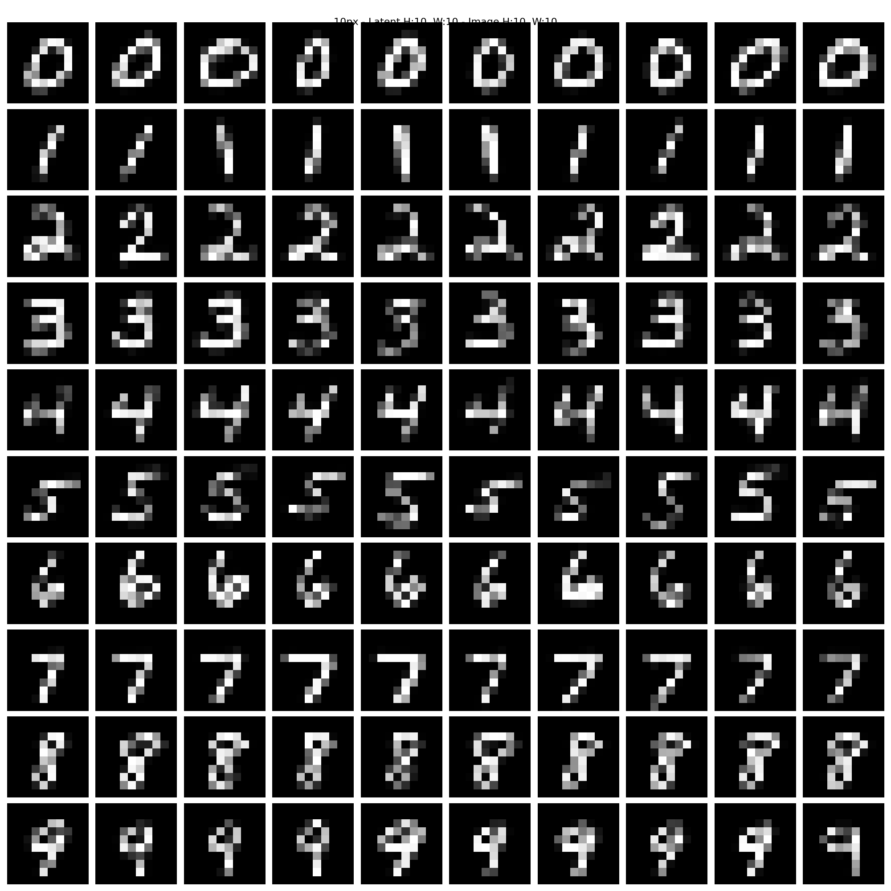
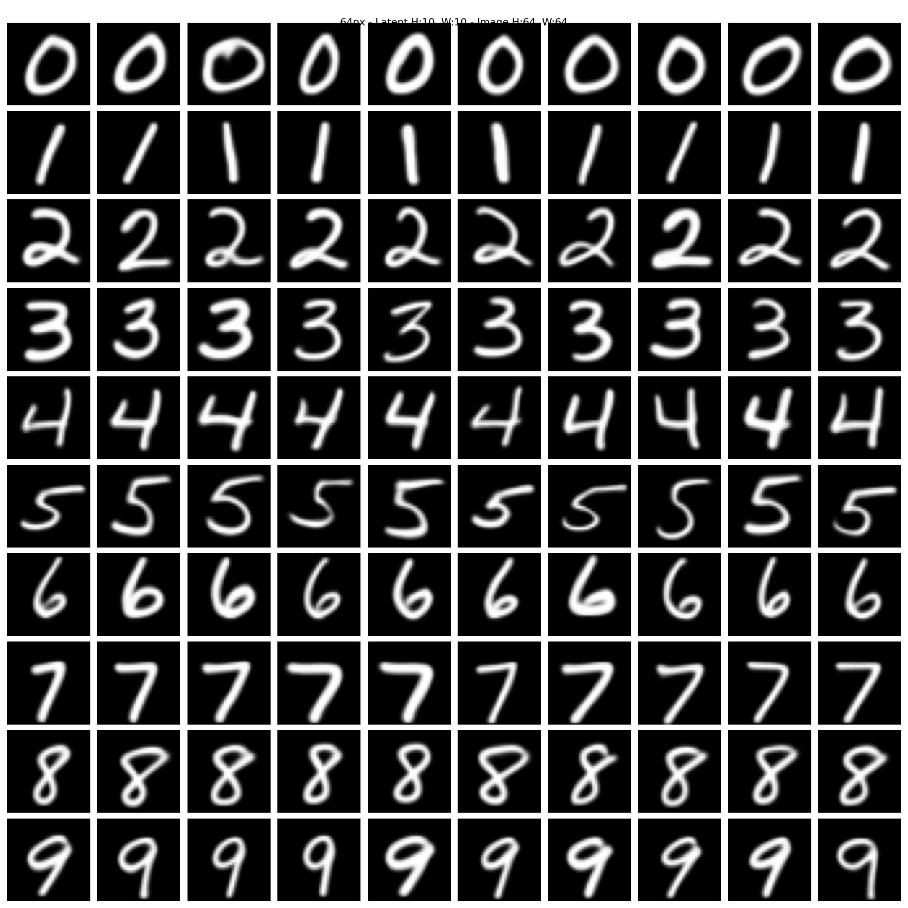
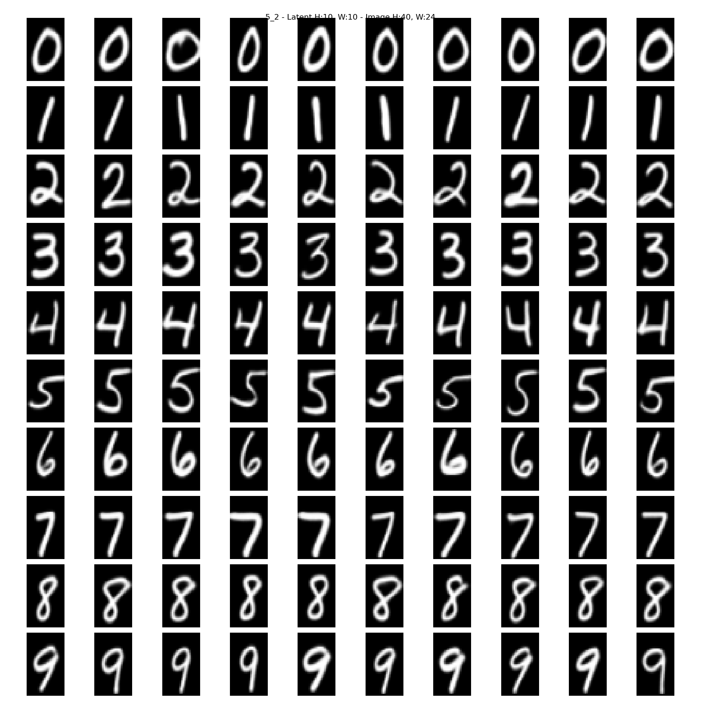

# R2IR-R2ID: Resolution Invariant Image Resampler - Resolution Invariant Image Diffuser

R2IR (Resolution Invariant Image Resampler) and R2ID (Resolution Invariant Image Diffuser) are a novel pair of
architectures for diffusion, designed to address key limitations in traditional models such as UNet and DiT. They treat
images as continuous functions rather than fixed pixel grids, enabling robust generalization to arbitrary resolutions
and aspect ratios without artifacts like doubling or squishing. The model learns an underlying data function, ignoring
pixel density, through dual positional embeddings and Gaussian coordinate jitter.

This is a proof-of-concept implementation, trained on unaugmented 32x32 (4x4 latent) MNIST digits on consumer hardware.

## Architecture Overview

R2IR-R2ID is a two-stage resolution invariant diffusion system:

Stage 1: R2IR (Resolution Invariant Image Resampler)

- **Purpose**: Learn a resolution invariant latent space that's smaller in height and width to have fewer tokens
- **Approach**: Cross attention between latent and image (and vice versa) to selectively pass information in and out of
  the latent based on dual coordinate positioning embeddings (relative + absolute)
- **How it works**
    - Encode: Image -> Latent (e.g. [1, 32, 32] -> [64, 8, 8])
    - Decode: Latent -> Image (e.g. [64, 8, 8] -> [1, 32, 32])

Stage 2: R2ID (Resolution Invariant Image Diffuser)

- **Purpose**: Diffuse the actual image
- **Key Components**:
    - AdaLN for time conditioning
    - Dual coordinate positioning system
    - Cross attention for text conditioning
    - Linear attention between all pixels to pass information around

Key distinctions:

- **Dual coordinate positional embedding**: relative (center to edge) and absolute (square bounded) coordinates
- **Gaussian raw coordinate jitter**: forces the model to learn images as continuous functions, generalize away from
  strict grids
- **Linear Attention**: makes R2IR viable for massive images, same thing for R2ID

See `modules/r2ir_r2id.py` for the full implementation of R2IR and R2ID.

## Results

Resulting images can be found in `media/` for various aspect ratios and resolutions. Releases have `media.zip` attached
with all 240 images. Keep in mind, that with the way that R2ID and R2IR work, all these images were diffused just once
in the latent space, and then R2IR simply sampled back into pixel space. The latent space is _not_ fixed size, but
dynamic. A smaller latent size would have resulted in worse quality, while a larger latent would result in a better one.
Both R2IR and R2ID were trained on 1:1 images, to create, diffuse and reconstruct 4x4 latents. Yet both models have
proved to generalize for aspect ratios and latent sizes.

Diffused on 10x10 latent, resampled into 10x10


Diffused on 10x10 latent, resampled into 16x16


Diffused on 10x10 latent, resampled into 64x64


Diffused on 10x10 latent, resampled into 40x24 (5:2 aspect ratio)


## Installation

Clone the repository or alternatively check the latest release:

```
git clone https://github.com/Yegor-men/resolution-invariant-image-diffuser.git
cd resolution-invariant-image-diffuser
```

Install the dependencies, preferably via some python environment like conda:

```
pip install torch torchvision matplotlib numpy tqdm
```

The code was developed and tested on CUDA enabled RTX 5080 on Arch Linux in PyCharm with Conda, Python 3.14.

## Usage

In order for the model to work, you need both R2IR and R2ID. Run `train_r2ir.py` to train and save an R2IR model; run
`train_r2id.py` to train and save a R2ID model and a corresponding dummy text encoder.

Once the models are in `models/` folder, run `inference.py` to diffuse some images. Make sure that the file names match.
The diffusion settings should be edited accordingly.

## Limitations & Future Work

- Messy code, refactor pending
- 28x28 MNIST-only for now; test on CelebA next
- more training

Suggestions welcome—open issues/PRs.

## License

This project is licensed under the MIT License, see `LICENSE` for details.

## Acknowledgments

Inspired by discussions on r/MachineLearning, mainly suggestions left in the comments of the Reddit posts. Thanks to
Google, OpenAI and xAI for developing their respective LLM chatbots that helped me with research, ideas, explanations
and analyses of diffusion architectures and suggestions as this project began deep in the Dunning-Kruger valley.