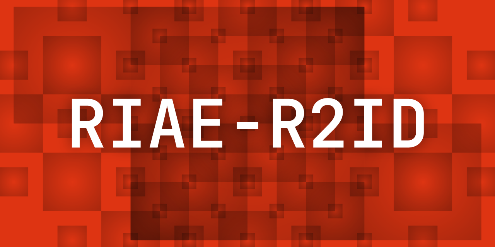
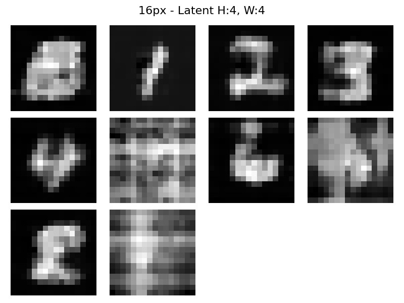
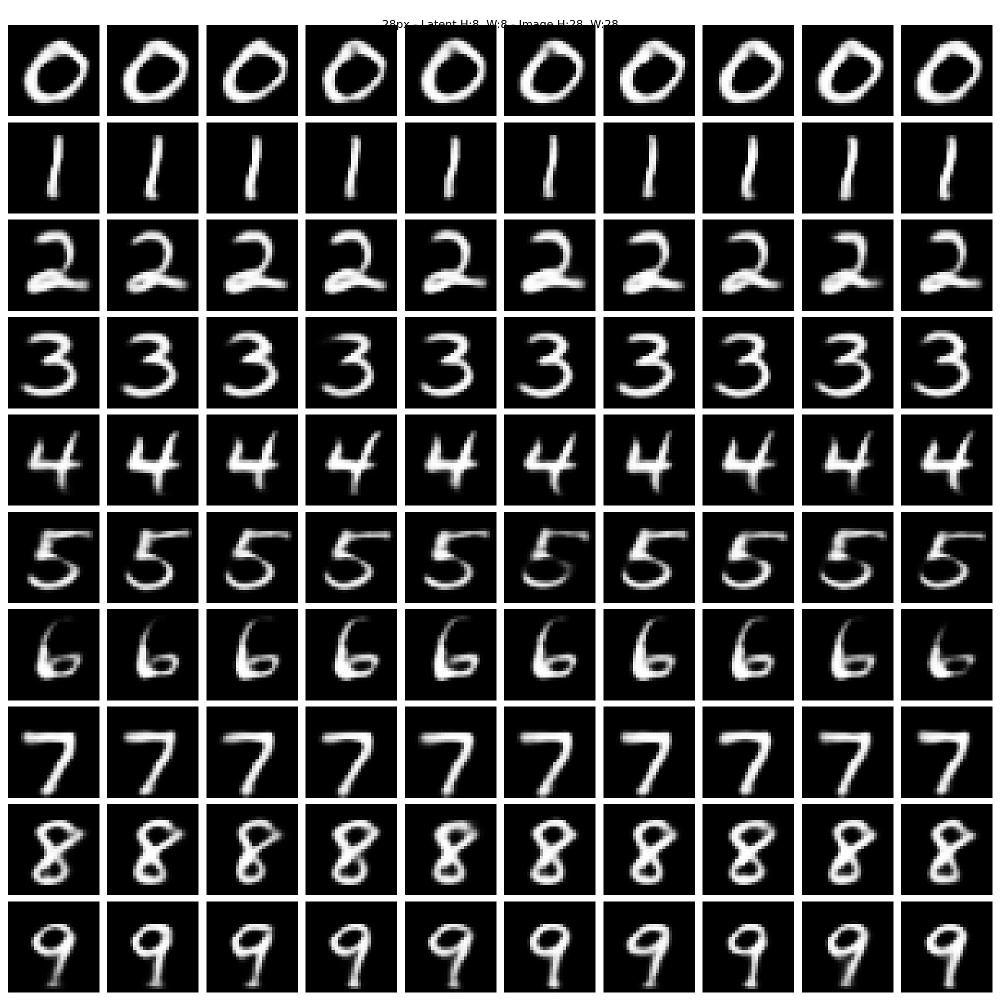
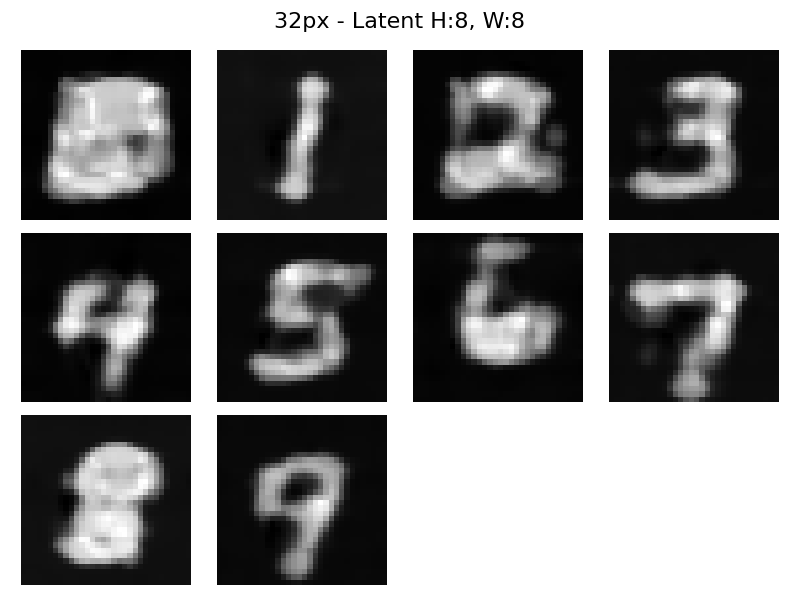

# RIAE-R2ID: Resolution Invariant Auto Encoder - Resolution Invariant Image Diffuser

RIAE (Resolution Invariant Auto Encoder)  and R2ID (Resolution Invariant Image Diffuser) are a novel pair of
architectures for diffusion, designed to address key limitations in traditional models such as UNet and DiT. They treat
images as continuous functions rather than fixed pixel grids, enabling robust generalization to arbitrary resolutions
and aspect ratios without artifacts like doubling or squishing. The model learns an underlying data function, ignoring
pixel density, through dual positional embeddings and Gaussian coordinate jitter.

This is a proof-of-concept implementation, trained on unaugmented 32x32 MNIST digits on consumer hardware.

## Features

- **Resolution Invariance**: Both RIAE and R2ID work agnostic of pixel density and resolution. This is because they
  treat pixels as collections of separate points sampled from some function. Subsequently, they learn the function, not
  the samples from it.
- **Aspect Ratio Invariance**: Both RIAE and R2ID use a unique dual positional embedding system with extra coordinate
  jitter during training. The system informs the model of both image edge boundaries and the proportions. This means
  that center coordinates don't change by much when you change the aspect ratio, only the edges change a lot more (and
  even then, at most by 50%), which means that the model generalizes really well.
- **Transformer Based**: Both RIAE and R2ID rely on transformers for the most part in order to work. The pixels are the
  tokens, containing both color and position information.
- **Arbitrary AE compression**: RIAE is trained to compress by 4x, but due to the resolution invariant nature, it
  generalizes to other resolutions too, even different aspect ratios. This is necessary as the main bottleneck behind
  using attention in R2ID is that pixels are expensive, so we need to compress their amount somehow into depth, while
  keeping the transformation reversible and resolution invariant.
- **Gaussian Coordinate Jitter**: During training, noise is added to coords (stdev=1/(2*dim)) to force learning of
  continuous functions, not discrete points.

## Installation

Clone the repository or alternatively check the latest release:

```
git clone https://github.com/Yegor-men/resolution-invariant-image-diffuser.git
cd resolution-invariant-image-diffuser
```

Install the dependencies, preferably via some python environment like conda:

```
pip install torch torchvision matplotlib numpy tqdm
```

The code was developed and tested on CUDA enabled RTX 5080 on Arch Linux in PyCharm with Conda, Python 3.14.

## Usage

In order for the model to work, you need both RIAE and R2ID. Run `train_riae.py` to train and save an RIAE model; run
`train_r2id.py` to train and save a R2ID model and a corresponding dummy text encoder.

Once the models are in `models/` folder, run `inference.py` to diffuse some images. Make sure that the file names match.
The diffusion settings should be edited accordingly.

## Architecture Overview

RIAE turns images of size [b, col_channels, h, w] into [b, lat_channels, h/reduction, w/reduction] with these steps:

1. Create an empty latent of the desired size
2. Populate the empty latent with the respective coordinates from the dual system
3. Create coordinates for the pixels in the image and concatenate the two
4. For each latent pixel, run cross attention with the latent pixel making the query, and a random set of the image
   pixels for the keys and values
5. Project the embedding dim used for MHA down to the number of latent channels

Then it has to turn a latent back out into pixel-space:

1. Create an empty pixel-space image of the desired size
2. Populate the empty pixel space with the respective coordinates from the dual system
3. Create coordinates for the pixels in the latent and concatenate the two
4. For each pixel in the final image, run cross attention with the pixel making the query, and a random set of the
   latent pixels for the keys and values (25% for training, 100% for inference)
5. Project the embedding dim used for MHA down to the number of color channels

But RIAE can also compress and decompress to different aspect ratios and resolutions, also without trouble. Considering
this, the latent is quite hard to interpret and does not contain anything remotely similar to how digits actually look
like.

R2ID is the actual image diffuser, and it works on the resolution invariant latent as such:

- Compute dual coords (-0.5 to 0.5): Relative (inscribed square for composition) + absolute (edge-aware).
- Add Gaussian jitter (train-only, std=1/(2*max_dim) for relative) to treat pixels as samples from a continuous
  function.
- Fourier embed coords (sin/cos at powers [-3..7] for high frequencies up to 128pi).
- Concat embeds + image colors, project to d_channels (256) via 1x1 conv.
- Encoder blocks: Cloud point attn + FFN, FiLM-modulated by time (alpha_bar embed).
- Decoder blocks: Cloud point + cross-attn to cond (reuses enc output for efficiency).
- Project back to epsilon noise via 1x1 conv.

See `modules/r2id.py` for full implementation (RIAE and RIID classes).

## Results

Resulting images can be found in `media/`. Keep in mind, that this is super early in training, literally a couple hours
total. Here are some examples:

16px


28px


32px native


## Limitations & Future Work

- Messy code, refactor pending
- 28x28 MNIST-only for now; test on CelebA next
- more training

Suggestions welcome—open issues/PRs.

## License

This project is licensed under the MIT License—see LICENSE for details.

## Acknowledgments

Inspired by discussions on r/MachineLearning, mainly suggestions left in the comments of the Reddit posts. Thanks to
Google, OpenAI and xAI for developing their respective LLM chatbots that helped me with research, ideas, explanations
and analyses of diffusion architectures as this project began deep in the Dunning-Kruger valley.