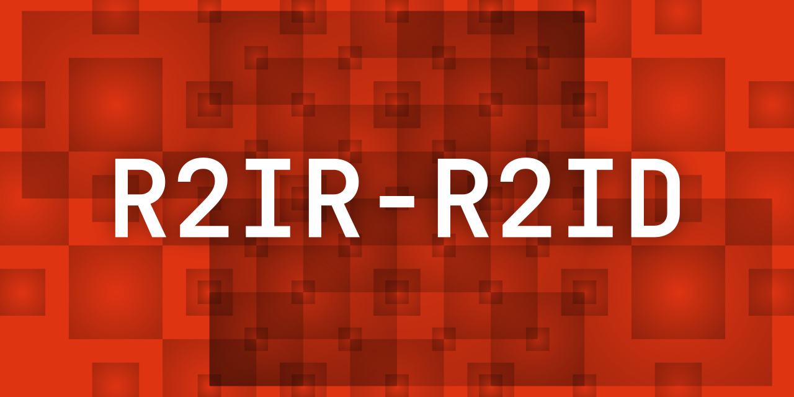

# R2IR-R2ID: Resolution Invariant Image Resampler - Resolution Invariant Image Diffuser

R2IR (Resolution Invariant Image Resampler) and R2ID (Resolution Invariant Image Diffuser) are a novel pair of
architectures for diffusion, designed to address key limitations in traditional models such as UNet and DiT. They treat
images as continuous functions rather than fixed pixel grids, enabling robust generalization to arbitrary resolutions
and aspect ratios without artifacts like doubling or squishing. The model learns an underlying data function, ignoring
pixel density, through dual positional embeddings and Gaussian coordinate jitter.

This is a proof-of-concept implementation, trained on unaugmented 32x32 MNIST digits on consumer hardware.

## Architecture Overview

R2IR-R2ID are a pair of models, used in tandem for diffusion. R2IR is used first, but the narrative makes more sense if
we analyze R2ID first, and R2IR second. It's important to note that both these models don't really treat the image as an
image per se, a grid. Instead, they treat it more like a group of discrete points which we happen to know about.

R2ID is the actual diffusion model (Resolution Invariant Image Diffuser). It operates on an arbitrary number of color
channels, and on arbitrary aspect ratios and resolutions. The reason for this is in the dual coordinate relative
positioning system, one absolute and one relative. However, despite the naming system, both systems are relative in that
the values are never correlated to the pixel's actual index. Relative and absolute is in reference to the image's own
edges versus the actual unstretched plane that it's sitting on. The relative system measures how far the pixel is away
from the center, and close to the edge. The X and Y coordinate is +-0.5 at the edges of the image, and 0 in the center.
The absolute coordinate system first inscribes the image into a square, and then makes the square's edges hold values of
+-0.5. If we only use the relative system, then when we train on one aspect ratio but inference on another, the model
will stretch and squeeze the image accordingly, because it never knew about absolute coordinates. If we only use the
absolute system, then when we train on one aspect ratio and diffuse on another, the model will crop the image, because
it never knew where the edges are. But by using these two systems together, the model is able to generalize across
aspect ratios surprisingly well, with minimal deformities at ratios well out of the trained norm, such as 2:1 while
being trained at 1:1. The reason that this works is because no matter your aspect ratio, likelihood is that the subject
is still centered. And when you change the aspect ratio, the center pixel's effective coordinates don't actually change
all that much, the ones that change most are the edges, and it's the edges' values that change with differing aspect
ratios, and there is no time that one value can be confused for a different ratio. Hence, we have 4 raw coordinates for
each pixel: X and Y, relative and absolute. During training, we jitter these coordinates by adding gaussian noise with
stdev of half a pixel's width/height, thus making the model generalize away from a rigid grid. Considering this, during
training, the pixel's coordinates are effectively from an infinitely accurate grid, which means that we can use
significantly more frequencies for the upcoming power of 2 fourier series. For example, just 16 positive and 16 negative
frequencies will make the generalize to images 65536 pixels in height and width. That is, you need 65536 pixels to have
the final frequency distinguishable from pure noise. The negative frequencies hence mean that you need 65536 total
images stacked side by side in order for the last frequency to be usable. While this is unused and redundant, it may be
an interesting direction of research to have the negative frequencies be truly absolute rather than relative. In any
case, we now have a very efficient way of representing pixel's coordinates. With the absurd overkill example, we'd only
need 256 channels for the positional coordinates. Concatenate the color channels atop, and expand from `c` to `d`
working channels via a 1x1 convolution, and R2ID is ready to diffuse. R2ID has 2 kinds of transformer blocks: EncBlock
which is used as a means for the model to first understand the composition and structure of the image, uses only AdaLN
for time conditioning and CloudAttention for inter-pixel information passing, and followed up by an FFN, residual
connections everywhere. DecBlock is the same as EncBlock, but we also have CrossAttention for text conditioning.
CloudAttention is an approximation of full attention by splitting the image into a bunch of separate, random "clouds",
and only attending the pixels within each cloud. More clouds means faster and cheaper inference, at the cost of quality.
The output of R2ID is the predicted epsilon noise.

By default, R2ID works. However, it suffers from heavily depending on the number of clouds used and the image size. For
example, a 1024x1024 image with 64 clouds would require 64 attention calls over a sequence length of 16384. Doable, but
not good. Thus, we need some kind of way to have fewer pixels. Early tests showed that pixel shuffle and unshuffle don't
work as they aren't scale invariant. CNNs also don't work as they're pixel density dependent and won't capture features
at pixel densities differing from what they're trained at. Thus, R2IR was developed. R2IR is a way of selectively
encoding and decoding data to and from a latent. The concept is that we use cross attention, and rely on the previously
used dual coordinate positioning system. For encoding, the Q is the latent (only coordinates) and the KV is the raw
image in pixel-space (coordinates and colors). The goal is that the model learns to meaningfully encode data into the
latent based on position. For decoding, the Q is the image (only coordinates) and the KV is the latent (coordinates and
colors). Thus, the goal for decoding is that the model learns to selectively extract data from the latent. This works,
but also hits a massive bottleneck in _even more_ attention calls. So for a 1024x1024 image, for encoding and
compressing the latent by 8x in height and width, we'd need 16384 attention calls over a sequence length of 1048576,
and for decoding, we'd need to do 1048576 attention calls over a sequence length of 16384. MultiHeadLinearAttention
proved to work however, so that is used instead. It scales linearly with the number of pixels, which is amazing as we
can also use it in R2ID too.

R2IR effectively changes the image's structure from raw pixel values, into a per-pixel approximation of what it thinks
the entire image is meant to be, based on the pixel's coordinate. Going back to the 256 positioning channels example,
we could hence dedicate 768 channels to the color to have at most 1024 channels, and yet the model's parameter count is
incredibly efficient at about 10 million or so. With 768 color channels, assuming a 3 channel RGB image as input, we've
effectively given each latent pixel 256 times as many channels, which means that we can reduce the height and width by
16x and the latent will still store the same amount of values as the raw image. The R2IR latent is hence unlike
autoencoder latents, and visualizations of it don't really make much sense. The latent is also a lot more robust to size
changes. You could train on one reduction (or none at all) but run inference on another. The only thing that's really
changing is the number of coordinates that are available, you just get a more or less refined view of the image.

All in all, R2IR and R2ID approach the task of diffusion as a collection of distinct points, of which we know their
color and relative coordinate. Then, based on the other pixels that we know about, we can predict the epsilon noise.

See `modules/r2id.py` for the full implementation of R2IR and R2ID.

## Results

Resulting images can be found in `media/`. Keep in mind, that this is super early in training, literally a couple hours
total. Here are some examples:

16px


28px


32px native


## Installation

Clone the repository or alternatively check the latest release:

```
git clone https://github.com/Yegor-men/resolution-invariant-image-diffuser.git
cd resolution-invariant-image-diffuser
```

Install the dependencies, preferably via some python environment like conda:

```
pip install torch torchvision matplotlib numpy tqdm
```

The code was developed and tested on CUDA enabled RTX 5080 on Arch Linux in PyCharm with Conda, Python 3.14.

## Usage

In order for the model to work, you need both R2IR and R2ID. Run `train_r2ir.py` to train and save an R2IR model; run
`train_r2id.py` to train and save a R2ID model and a corresponding dummy text encoder.

Once the models are in `models/` folder, run `inference.py` to diffuse some images. Make sure that the file names match.
The diffusion settings should be edited accordingly.

## Limitations & Future Work

- Messy code, refactor pending
- 28x28 MNIST-only for now; test on CelebA next
- more training

Suggestions welcome—open issues/PRs.

## License

This project is licensed under the MIT License, see `LICENSE` for details.

## Acknowledgments

Inspired by discussions on r/MachineLearning, mainly suggestions left in the comments of the Reddit posts. Thanks to
Google, OpenAI and xAI for developing their respective LLM chatbots that helped me with research, ideas, explanations
and analyses of diffusion architectures and suggestions as this project began deep in the Dunning-Kruger valley.